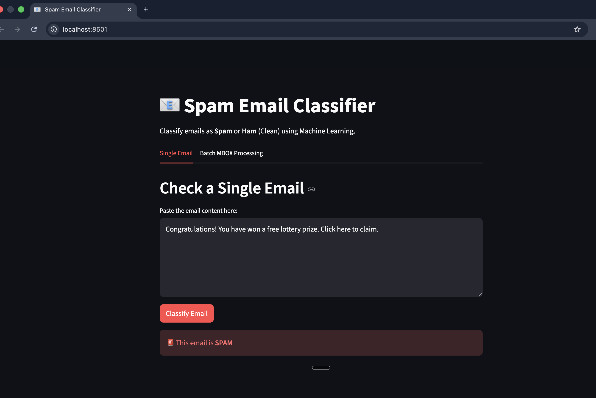
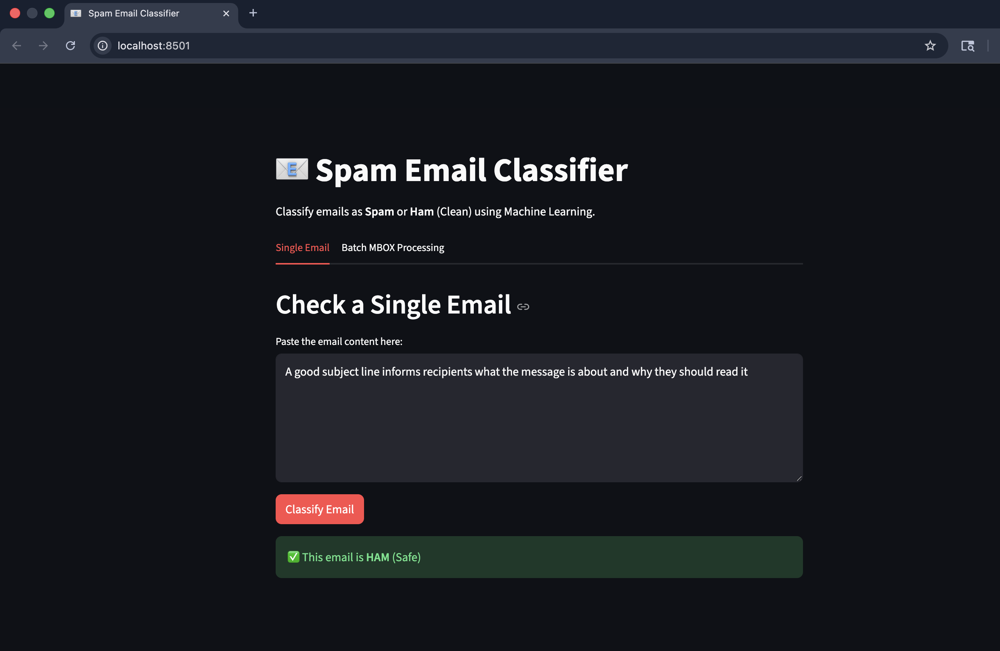

# AI Email Spam Detection System

**Developed by:** Kartik Mathpati

This project implements an AI-based email spam detection system that classifies incoming email messages as **Spam** or **Ham (legitimate emails)**. The system uses **Natural Language Processing (NLP)** and **Machine Learning algorithms** to analyze email content and predict whether an email is spam.

The application provides an interactive web interface built using **Streamlit**, allowing users to test individual emails or process multiple emails from an **MBOX archive**.

---

## 📷 Application Screenshots

### Spam Detection Interface


### Email Prediction Example


---

## 🚀 Key Features

- **Advanced ML Pipeline** – Modular design separating data ingestion, transformation, and model training.
- **Multiple Model Support** – Evaluation of algorithms including **SVM, Logistic Regression, Decision Trees, and Random Forest**.
- **Interactive Web UI** – Built using **Streamlit** for real-time email classification.
- **MBOX File Support** – Process and classify multiple emails from an email archive.
- **Performance Analytics** – Logs metrics such as **Precision, Recall, Accuracy, and F1-Score**.

---

## 🛠️ Tech Stack

| Category | Technology |
|--------|-------------|
| Programming Language | Python 3.10+ |
| Frontend | Streamlit |
| Machine Learning | Scikit-learn |
| Data Processing | Pandas, NumPy |
| Text Processing | BeautifulSoup4 |
| Package Management | pip / uv |

---

## 📂 Project Structure

```
AI-Email-Spam-Detection
│
├── app.py                  # Main Streamlit Web Application
├── requirements.txt        # Project dependencies
├── main.py                 # Alternative entry point
│
├── src/
│   ├── components/         # Data ingestion & transformation
│   ├── pipeline/           # Training and prediction pipelines
│   ├── config/             # Configuration files
│   └── utils/              # Helper functions and logging
│
├── data/                   # Dataset storage
├── outputs/                # Trained models & vectorizers
└── logs/                   # System logs
```

## ⚡ Installation

1. **Clone the Repository**
   ```bash
   git clone <repository_url>
   cd Spam-Email-Detection
   ```

2. **Set up Environment**
   It is recommended to use a virtual environment.
   ```bash
   python -m venv .venv
   source .venv/bin/activate  # On Windows: .venv\Scripts\activate
   ```

3. **Install Dependencies**
   ```bash
   pip install -r requirements.txt
   ```

## 🖥️ Usage

### 1. Running the Web Application
Launch the interactive dashboard to classify emails instantly.

```bash
streamlit run app.py
```

- **Single Email Tab**: Paste email content to get an immediate Spam/Ham prediction with a confidence score.
- **Batch Processing Tab**: Upload an `.mbox` file to process multiple emails at once and download the results as a CSV.

### 2. Training the Model
(Optional) If you wish to retrain the models on new data:

1. Place your dataset in `data/dataset/dataset.csv`.
2. Run the training pipeline:
   ```bash
   python -m src.pipeline.training_pipeline
   ```
3. Artifacts (Model & Vectorizer) will be saved in the `outputs/` directory.
4. **Important**: Update `src/config/config.py` with the new paths to your generated model and vectorizer if they change.

## ⚙️ Configuration

The system is highly configurable via `src/config/config.py`. You can adjust:
- Model hyperparameters (Grid Search configuration)
- Input/Output paths
- Training parameters (Cross-validation folds, etc.)

## 📊 Model Performance

The pipeline automatically evaluates models using 5-fold cross-validation. Metrics including Accuracy, Precision, Recall, and F1-Score are logged for each experiment. By default, the system selects the best performing model (often SVM or Random Forest) for inference.

## 🤝 Contributing

1. Fork the Project
2. Create your Feature Branch (`git checkout -b feature/AmazingFeature`)
3. Commit your Changes (`git commit -m 'Add some AmazingFeature'`)
4. Push to the Branch (`git push origin feature/AmazingFeature`)
5. Open a Pull Request

## 📝 License

Distributed under the MIT License. See `LICENSE` for more information.
